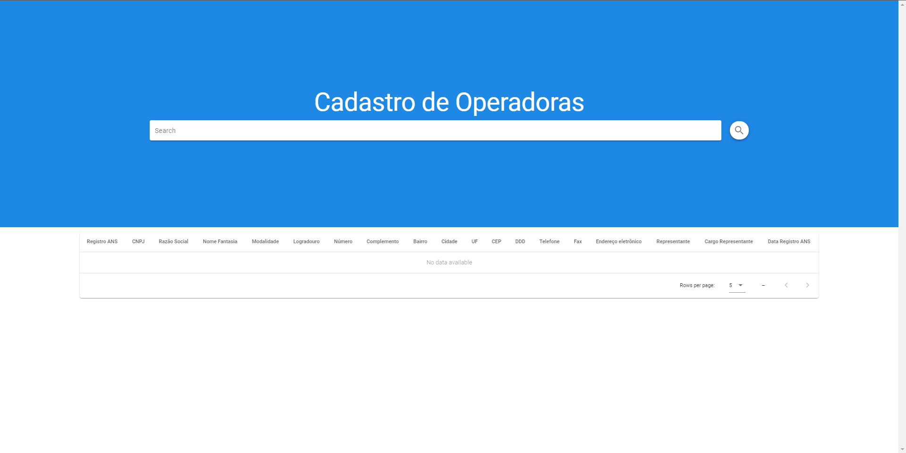
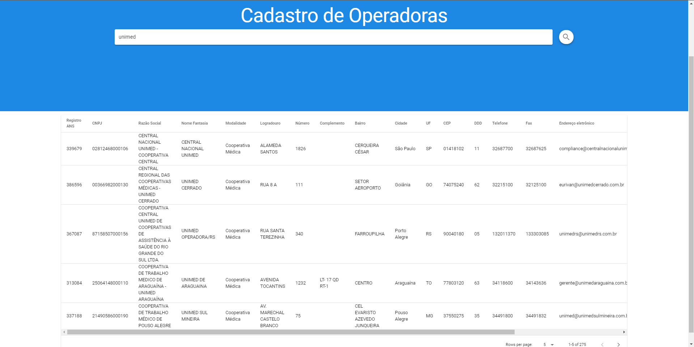

# **Teste-4---FrontEnd**

- This project is part of a set of other tests. Check it out:
  - [Test 1 - Web Scrapping](https://github.com/AkatGabrielGoncalves/Teste-1---WebScraping)
  - [Test 2 - Transformação de dados](https://github.com/AkatGabrielGoncalves/Teste-2---Transformacao-de-dados)
  - [Test 3 - Banco de dados](https://github.com/AkatGabrielGoncalves/Teste-3---Banco-de-dados)

## **This project is live!**
- The frontend is deployed to **Heroku**: https://intuitive-cadastro-op.herokuapp.com/
- The backend was deployed to **AWS Lambda** using the serverless framework.
## **What does this project do?**

- Creates a web interface to communicate with the backend API which reachs out to a database that is populated with data from [Test 3](https://github.com/AkatGabrielGoncalves/Teste-3---Banco-de-dados/blob/master/cadastro_op/Relatorio_cadop.csv).

## **Frontend**

```
cd frontend
```

### Install dependencies

```
yarn install
```

### Start local server

```
yarn serve
```

### Build project

```
yarn build
```

### **Frontend images**





### **What dependencies does this project use?**

- Vue
- Vuetify
- Axios
- Typescript

### **Description**

- The frontend was built using Vue.js with Vuetify, written in TypeScript and to communicate with the backend was used Axios.
- Remember to set the enviroment variable:
  - VUE_APP_BACKENDHOST
    - Remember to set up inside a .env.development file in the root directory of the frontend.

## **Backend**

```
cd backend
```

### Install dependencies

```
yarn install
```

### Start server

```
yarn start
```

### **What dependencies does this project use?**

- Express.js
- Postgres driver

### **Description**

- The backend was written in plain javascript to keep it simple, it uses Express.js to create a server and the postgres driver to communicate with the database.
- The backend expects to use a database populated with the following data:
  - [data](https://github.com/AkatGabrielGoncalves/Teste-3---Banco-de-dados/blob/master/cadastro_op/Relatorio_cadop.csv)
  - You can use my repository: [Test 3](https://github.com/AkatGabrielGoncalves/Teste-3---Banco-de-dados) which has a postgres script for populating the database.
- The backend only has one route:
  - `/registration?search=XXX&page=XXX&perPage=XXX`
  - The response will be a object containing the rows and fields:
    - `response: { rows[], fields[] }`
- There are enviroment variables that are needed:
  - DBUSER
  - DBHOST
  - DBNAME
  - DBPASSWORD
  - DBPORT
    - Remember to set up inside a .env.dev file in the root directory of the backend.
